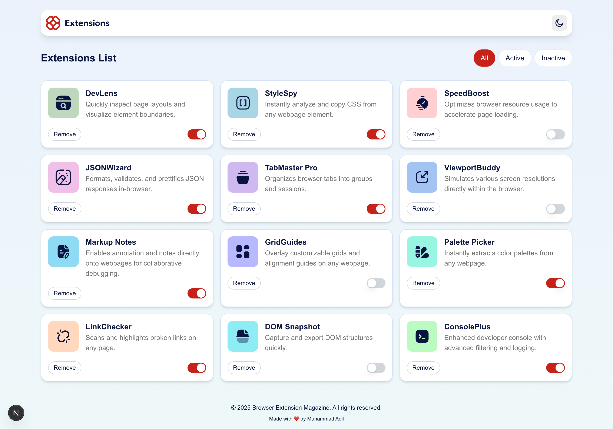
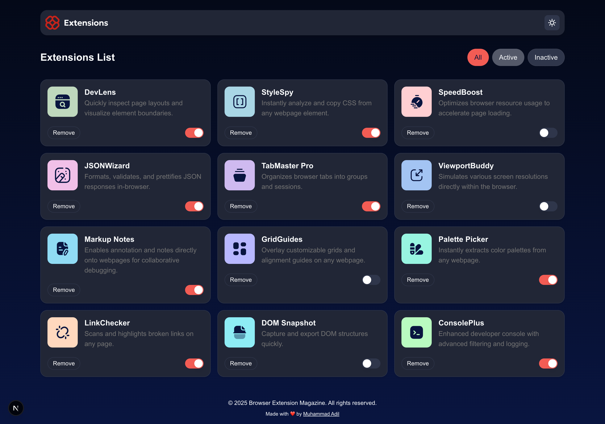
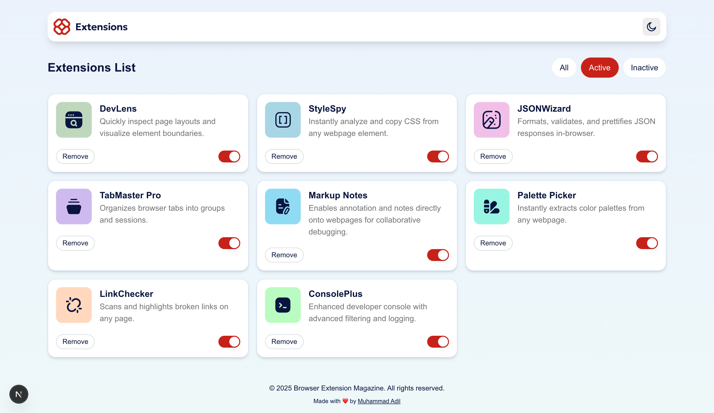
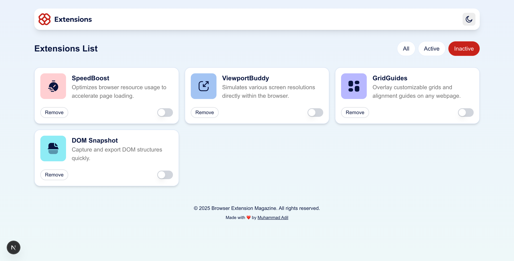
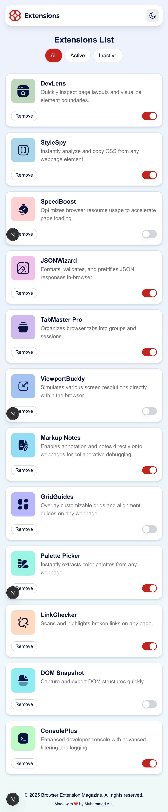
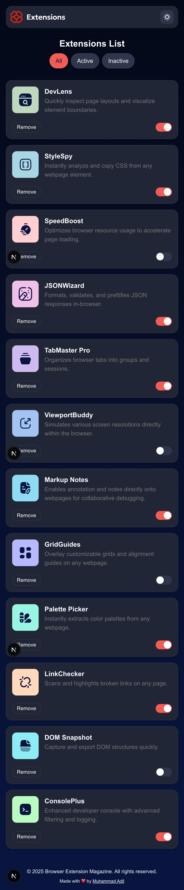

# Frontend Mentor - Browser Extensions Manager UI solution

This is a solution to the [Browser Extensions Manager UI challenge on Frontend Mentor](https://www.frontendmentor.io/challenges/browser-extension-manager-ui-yNZnOfsMAp). Frontend Mentor challenges help you improve your coding skills by building realistic projects.

## Table of contents

- [Overview](#overview)
  - [The challenge](#the-challenge)
  - [Screenshot](#screenshot)
  - [Links](#links)
- [My process](#my-process)
  - [Built with](#built-with)
  - [What I learned](#what-i-learned)
  - [Continued development](#continued-development)
  - [Useful resources](#useful-resources)
- [Author](#author)

## Overview

### The challenge

Users should be able to:

- Toggle extensions between active and inactive states
- Filter active and inactive extensions
- Remove extensions from the list
- Select their color theme
- View the optimal layout for the interface depending on their device's screen size
- See hover and focus states for all interactive elements on the page

### Screenshot








### Links

- Solution URL: [GitHub Repository](https://github.com/iniadil/browser-ext-mag-ui-frontend-mentor)
- Live Site URL: [Live Demo](https://browser-ext-mag-ui-frontend-mentor.pages.dev/)

## My process

### Built with

- Semantic HTML5 markup
- CSS custom properties
- Flexbox
- CSS Grid
- Mobile-first workflow
- [React](https://reactjs.org/) - JS library
- [Next.js 15](https://nextjs.org/) - React framework with App Router
- [TypeScript](https://www.typescriptlang.org/) - For type safety
- [Tailwind CSS v4](https://tailwindcss.com/) - For styling
- [Zustand](https://zustand-demo.pmnd.rs/) - For state management
- [next-themes](https://github.com/pacocoursey/next-themes) - For theme switching

### What I learned

Working on this project helped me deepen my understanding of several key concepts:

**State Management with Zustand**: I learned how to implement a clean, lightweight state management solution for handling extension data and UI state.

```js
const useExtensionsStore = create((set) => ({
  extensions: [],
  filter: "all",
  setExtensions: (extensions) => set({ extensions }),
  toggleExtension: (id) =>
    set((state) => ({
      extensions: state.extensions.map((ext) =>
        ext.id === id ? { ...ext, isActive: !ext.isActive } : ext,
      ),
    })),
}));
```

**Theme System Implementation**: I implemented a robust theme switching system using next-themes and Tailwind CSS custom properties.

```css
@layer base {
  :root {
    --color-neutral-900: 227 75% 14%;
    --color-neutral-800: 226 25% 17%;
  }

  [data-theme="dark"] {
    --color-neutral-900: 0 0% 93%;
    --color-neutral-800: 0 0% 78%;
  }
}
```

**Component Composition**: I learned to create reusable themed components that adapt to both light and dark modes seamlessly.

### Continued development

In future projects, I want to continue focusing on:

- **Advanced TypeScript patterns** - Exploring more complex type definitions and generic constraints
- **Performance optimization** - Implementing virtual scrolling for large lists and optimizing re-renders
- **Testing strategies** - Adding comprehensive unit and integration tests with Jest and React Testing Library
- **Accessibility improvements** - Implementing better keyboard navigation and screen reader support

### Useful resources

- [Zustand Documentation](https://zustand-demo.pmnd.rs/) - This helped me understand lightweight state management. The simple API made it perfect for this project.
- [Tailwind CSS v4 Alpha](https://tailwindcss.com/blog/tailwindcss-v4-alpha) - The new CSS-first configuration approach simplified the setup process significantly.
- [Next.js App Router Guide](https://nextjs.org/docs/app) - Essential for understanding the new App Router patterns and server/client component boundaries.
- [Frontend Mentor Community](https://www.frontendmentor.io/community) - Getting feedback from other developers helped refine the implementation.

## Author

- Frontend Mentor - [@iniadil](https://www.frontendmentor.io/profile/iniadil)
- GitHub - [@iniadil](https://github.com/iniadil)
- LinkedIn - [@yourusername](https://www.linkedin.com/in/adil-muhammad-562722276)
